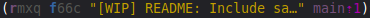
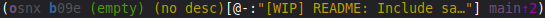
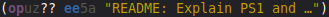

# vcs-bash-prompt

A custom Bash prompt for Jujutsu (jj) that integrates with the Git prompt.

The Jujutsu prompt includes:
* short change ID
* short commit ID
* indicators for:
    * hidden change
    * divergent changes
    * empty change
    * conflict
* change description (truncated to a configurable length)
* if current change description is empty, includes the parent change description inside `[@-:`...`]`
* the closest bookmark and its distance

Some samples:

* Change with description

  

* Change without description or content

  

* Divergent change

  


## Configuration

1. Download and save [vcs-prompt.sh](./vcs-prompt.sh).
    * On Linux or Cygwin: save it in `~/.config/bash/`. Create that directory if it doesn't exist.
    * On Git Bash for Windows: save it as `~/.config/git/git-prompt.sh`. Note the difference:
        * `~/.config/git/git-prompt.sh` - Correct
        * `~/.config/bash/vcs-prompt.sh` - WRONG!
2. Download and save [jj-prompt.sh](./jj-prompt.sh) to the same location.
3. Edit the `vcs-prompt.sh` file (or `git-prompt.sh` in Git Bash for Windows):
    1. Towards the end of the file, include the path for the `git-prompt.sh` file from the Git project.
      See [where you can find it](#the-git-promptsh-file-from-the-git-project).

        Example on Linux:
        ```bash
        # Sources the git-prompt.sh file from the Git project
        source /usr/lib/git-core/git-sh-prompt
        ```

        Example on Cygwin:
        ```bash
        # Sources the git-prompt.sh file from the Git project
        source ???TODO???
        ```

        Example on Git Bash for Windows:
        ```bash
        # Sources the git-prompt.sh file from the Git project
        source /mingw64/share/git/completion/git-prompt.sh
        ```
    2. At the very end of the file, define a value for `PS1` or `PROMPT_COMMAND` (not both!).
      [See instructions below](#defining-values-for-ps1-or-prompt_command-variables).
    3. Optional: customize the prompt output by setting the variables `GIT_PS1_*` and `JJ_PS1_*`.

4. Only on Linux and Cygwin: add the line below to `~/.bashrc`.
    ```bash
    source ~/.config/bash/vcs-prompt.sh
    ```


## The `git-prompt.sh` file from the Git project

The Git project has the file `git-prompt.sh` that implements the default custom prompt for Git. Some Git
platform may already include it. Check the table below where it can be found:

| Platform               | Path                                                      |
| ---------------------- | --------------------------------------------------------- |
| Debian / Ubuntu / Mint | `/usr/lib/git-core/git-sh-prompt` (without any extension) |
| Cygwin                 | `???TODO???`                                              |
| Git Bash for Windows   | `/mingw64/share/git/completion/git-prompt.sh`             |

If not included in the packaging you use, it can be downloaded from the Git repository:
https://github.com/git/git/blob/master/contrib/completion/git-prompt.sh.
Save it as `~/.config/git/git-prompt.sh` and then use this path in the `source` command.

Additionally, you can clone the Git project and use the file included:

```bash
git clone https://github.com/git/git.git
# or:
jj git clone https://github.com/git/git.git
```

Then, e.g., if you cloned it to a directory under `~/work`, use the path `~/work/git/contrib/completion/git-prompt.sh`
in the `source` command.


## Defining values for `PS1` or `PROMPT_COMMAND` variables

You can use some ready-made definition:

| System               | Variable and value to use |
| -------------------- | --------------------------|
| Linux                | `export PROMPT_COMMAND='__vcs_ps1 "\[\e]0;\u@\h: \w\a\]${debian_chroot:+($debian_chroot)}\[\033[01;32m\]\u@\h\[\033[00m\]:\[\033[01;34m\]\w\[\033[00m\]" "\$ "'` |
| Cygwin               | `export ???TODO???` |
| Git Bash for Windows | ``export PS1='\[\033]0;$TITLEPREFIX:$PWD\007\]\n\[\033[32m\]\u@\h \[\033[35m\]$MSYSTEM \[\033[33m\]\w\[\033[36m\]`__vcs_ps1`\[\033[0m\]\n$ '`` |

If you want to define the value yourself, first decide [which one to use](https://www.google.com/search?q=PS1+vs+PROMPT_COMMAND).
Git Bash for Windows uses `PS1`, but a comment in
[the `git-prompt.sh` file from the Git project](#the-git-promptsh-file-from-the-git-project)
mentions that `PROMPT_COMMAND` is "slightly faster".

The general idea is that:
  * `PS1` is a *string that is printed* as the prompt and may include commands with `$(...)` or `` `...` ``;
  * `PROMPT_COMMAND` is a *command that prints* the prompt and/or *sets `PS1`*;

You can use this command to get the current values:

```bash
for V in PS1 PROMPT_COMMAND; do if [[ -v $V ]]; then echo "$V: '${!V}'"; else echo "$V is not set"; fi; done
```

The current `PS1` value can be split where you want the repository info to be placed. Then:
  * To define the new value for `PS1`, insert `__vcs_ps1` as a command to run between the split parts.
  * To use `PROMPT_COMMAND`, execute `__vcs_ps1` passing the two split parts as appropriately quoted parameters.

If you want to configure the prompt only for Jujutsu, you can use the command `__jj_ps1` instead of `__vcs_ps1`,
or `__git_ps1` for only the Git prompt.


### Example

If your current `PS1` is "`\[\033[01;34m\]\w\[\033[00m\]\$ `" and want to have the repository
info placed before the "`$ `":
  * The split parts:
    * "`\[\033[01;34m\]\w\[\033[00m\]`"
    * "`\$ `"
  * Then you can define:

    ```bash
    export PS1='\[\033[01;34m\]\w\[\033[00m\]$(__vcs_ps1)\$ '
    ```

    or:

    ```bash
    export PROMPT_COMMAND='__vcs_ps1 "\[\033[01;34m\]\w\[\033[00m\]" "\$ "'
    ```
